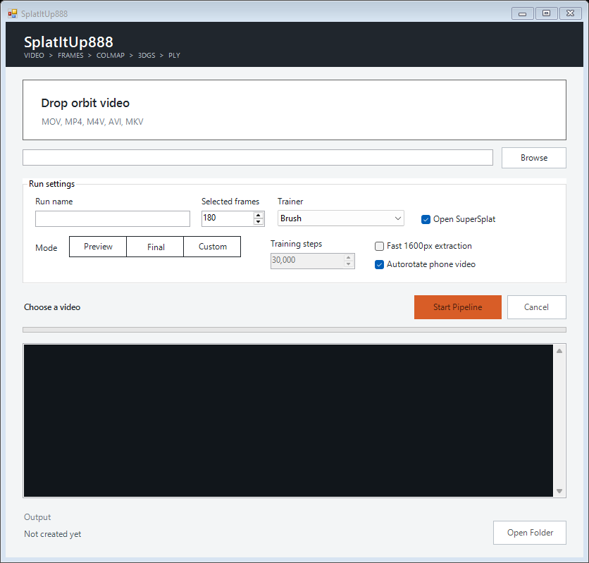

# SplatItUp888

SplatItUp888 is a native Windows drag-and-drop pipeline that turns an object orbit, an aerial building exterior, an open connected walkthrough, or a closed-loop house walkthrough into a verified 3D Gaussian Splat and a self-contained Blender scene.



## What It Does

1. Probes and decodes phone or camera footage with FFmpeg.
2. Measures sharpness, exposure, clipping, optical flow, track survival, and homography residual before selecting frames.
3. Reconstructs object captures with exhaustive/global COLMAP mapping, connected walkthroughs with sequential/vocabulary matching and incremental mapping, and aerial exteriors with sequential/vocabulary matching plus calibrated global mapping.
4. Rejects disconnected, incomplete, or discontinuous camera solves before expensive training begins; the strict House profile also requires loop closure.
5. Trains a full Gaussian Splat with Brush and saves deterministic photometric holdout renders plus PSNR/SSIM metrics.
6. Fully reads and hashes the binary Gaussian PLY, including finite-value and 45-coefficient spherical-harmonic checks.
7. Builds a Blender file containing the KIRI splat, the solved COLMAP camera animation, a visible trajectory, and a shared world parent for aligned camera moves.

## Upgrades

- Object Preview: 7,000 steps and 150 selected frames.
- Object Final: 30,000 steps and 300 selected frames.
- Walkthrough Preview: 10,000 steps and 300 selected frames.
- Walkthrough Final: 40,000 steps and 1,200 selected frames; loop closure is measured but non-blocking.
- House Preview: 10,000 steps and 300 selected frames.
- House Final: 40,000 steps and 1,200 selected frames; loop closure is required.
- Aerial Exterior Preview: 10,000 steps and 300 selected frames.
- Aerial Exterior Final: 40,000 steps and at least 1,200 flow-spaced frames; loop closure is measured but non-blocking.
- Explicit phone-video autorotation control.
- Lucas-Kanade motion qualification avoids redundant frames and pure tripod pans that cannot solve depth reliably.
- Profile-specific reconstruction gates cover registration, sparse points, track length, reprojection error, verified-graph connectivity, missing-frame runs, loop closure, and camera jumps.
- Source, image-content, tool-version, profile, script, and artifact hashes invalidate stale resume state.
- Starting from a later stage fails closed unless the entire source-to-stage provenance chain is current.
- Interrupted attempts are recorded separately; the last successful manifest is never replaced by a failed run.
- Candidate PLYs and quality reports publish together; replaced masters and their evidence are preserved under `final/history`.
- A replaced or user-edited Blender file is preserved under `blender/history` before the app rebuilds its verified handoff.
- Blender 5.0 performs the tested KIRI import; the resulting self-contained file opens in Blender 5.2 for camera work.
- Auto uses Brush by default and retains Spirula when it is explicitly selected. Experimental `3DGUT-MCMC` is limited to a manual Aerial Exterior 1K/250K smoke that stops for visual review without publishing.

## Requirements

- Windows 10 or 11
- PowerShell 5.1+
- NVIDIA GPU recommended
- Python with OpenCV, Pillow, and NumPy (the pinned environment is in `requirements.txt`)
- FFmpeg and FFprobe
- COLMAP 4.1.1 CUDA and its 32K FAISS vocabulary tree
- Brush for the stable training backend
- Blender 5.0 with the user's installed KIRI 3DGS Render 4.1.5 add-on
- Blender 5.2 to open and animate the delivered scene
- Optional local SuperSplat build
- Optional [NVIDIA 3DGRUT](https://github.com/nv-tlabs/3dgrut)

## Setup

1. Copy `splatitup.config.example.psd1` to `splatitup.local.psd1`.
2. Create the isolated Python environment and install the pinned image-processing dependencies:

```powershell
python -m venv .venv
.\.venv\Scripts\python.exe -m pip install -r requirements.txt
```

3. Add paths for tools that are not available on `PATH`.
4. Run the diagnostic:

```powershell
powershell.exe -NoProfile -ExecutionPolicy Bypass -File .\scripts\doctor.ps1
```

5. Launch `Launch SplatItUp888.cmd` and drop in one video or a batch of videos.

Run the focused quality-contract tests at any time:

```powershell
.\.venv\Scripts\python.exe -m unittest discover -s tests -v
```

The local configuration, tools, and reconstruction runs are intentionally ignored by Git.

## Production Queue

Select or drop multiple videos to create a persistent, serialized queue. The app hashes every source, gives each job a collision-safe run name, runs one GPU job at a time, records per-job attempts and errors, and continues to the next video when one job fails or stops for review. Re-selecting the same source resumes its hash-verified stages. Queue state is stored under `<OutputRoot>\.queues`.

Production configuration includes a hard single-job free-space floor and a per-pending-job reserve. The diagnostic checks the configured planned queue before reporting a mechanical production pass. Exclusive output and run locks prevent concurrent app instances from writing the same GPU pipeline or run folder.

## Command Line

```powershell
powershell.exe -NoProfile -ExecutionPolicy Bypass `
  -File .\pipeline\run_video_to_splat.ps1 `
  -VideoPath "C:\captures\orbit.mov" `
  -RunName "atv-orbit-01" `
  -SceneType Object `
  -SelectedFrames 300 `
  -TrainingSteps 30000 `
  -AdaptiveExtraction `
  -CandidateMultiplier 4 `
  -TrainingMaxResolution 1920 `
  -Trainer Brush `
  -OpenBlender
```

Fast preview:

```powershell
powershell.exe -NoProfile -ExecutionPolicy Bypass `
  -File .\pipeline\run_video_to_splat.ps1 `
  -VideoPath "C:\captures\orbit.mov" `
  -SceneType Object `
  -SelectedFrames 150 `
  -TrainingSteps 7000 `
  -AdaptiveExtraction `
  -MaxLongSide 1600
```

House walkthrough:

```powershell
powershell.exe -NoProfile -ExecutionPolicy Bypass `
  -File .\pipeline\run_video_to_splat.ps1 `
  -VideoPath "C:\captures\house-walkthrough.mov" `
  -SceneType House `
  -SelectedFrames 1200 `
  -TrainingSteps 40000 `
  -AdaptiveExtraction `
  -CandidateMultiplier 2 `
  -OpenBlender
```

Open connected walkthrough, such as a garden into a greenhouse:

```powershell
powershell.exe -NoProfile -ExecutionPolicy Bypass `
  -File .\pipeline\run_video_to_splat.ps1 `
  -VideoPath "C:\captures\garden-greenhouse.mov" `
  -SceneType Walkthrough `
  -SelectedFrames 1200 `
  -TrainingSteps 40000 `
  -AdaptiveExtraction `
  -CandidateMultiplier 2 `
  -OpenBlender
```

Aerial building exterior:

```powershell
powershell.exe -NoProfile -ExecutionPolicy Bypass `
  -File .\pipeline\run_video_to_splat.ps1 `
  -VideoPath "C:\captures\building-drone-orbit.mov" `
  -SceneType AerialExterior `
  -SelectedFrames 1200 `
  -TrainingSteps 40000 `
  -AdaptiveExtraction `
  -CandidateMultiplier 8 `
  -MaxCumulativeFlow 0.0125 `
  -OpenBlender
```

Object footage should complete a smooth orbit with visible translation and views of the top and lower surfaces. Use AerialExterior for a drone orbit or stitched exterior passes around a building; it uses chronological matching with global mapping and does not require the final camera to return to the first position. Use Walkthrough when the route is continuous through connected spaces but does not return to its starting area. Use House only when the route returns to its starting area and the loop-closure gate has real visual evidence. Lock exposure, white balance, focus, lens/zoom, and shutter speed while recording. Dewarp fisheye/action-camera footage to a fixed perspective view before using this pipeline.

## Trainer Notes

Brush is the default full-production trainer. Spirula is also available as an explicitly selected external backend and must pass the same signed reconstruction, independent holdout, PLY, and provenance gates. Plain `3DGUT` and non-aerial `3DGUT-MCMC` runs fail closed because they have no approved measured gate. A manual Aerial Exterior `3DGUT-MCMC` run requires the separate 3DGRUT installation and configured runtime paths; it signs the undistorted dataset, runs exactly the capped 1K smoke, writes `training_decision.json`, and stops with `AWAITING_VISUAL_QC`. It does not run 7K/final training or publish a master PLY.

3DGRT is deliberately not exposed in the desktop app because it is slower and its reflection/refraction benefits are not the normal video-to-splat requirement. Rasterized 3DGUT remains disabled until a measured route is approved; MCMC is exposed only for the bounded aerial smoke described above.

## Output

Each run contains:

- `selected_frames_contact_sheet.jpg`
- `frame_quality.json` and CSV
- `reconstruction_report.json`
- `training_quality_report.json` and holdout renders
- COLMAP database, images, and sparse model
- training logs and stage markers
- `gaussian_ply_report.json`
- `final/<run-name>.ply`
- `blender/<run-name>.blend`
- `blender/blender_handoff_preview.png`
- `blender/blender_handoff_report.json`
- `blender/blender_52_open_report.json`
- `run_manifest.json`
- `run_attempt.json` for the current or most recent attempt, with immutable attempt receipts under `logs`
- `training_decision.json` when an experimental 1K smoke stops for visual review
- hash-named prior masters and provenance under `final/history` when retraining replaces a result

The Blender scene contains one authoritative Gaussian surface and the solved camera path under `SPLATITUP_WORLD`. Create or duplicate a camera for cinematic moves; transform the shared parent when repositioning or leveling the capture. Automated checks report `MECHANICAL PASS`; holdout metrics remain `measured_unrated`, and visual quality remains `AWAITING USER APPROVAL` until the result is inspected.

## Acknowledgements

The implementation builds on the official [COLMAP](https://github.com/colmap/colmap) and [Brush](https://github.com/ArthurBrussee/brush) projects. The optional Spirula backend runs as a separate GPL executable. Alternate-trainer research included [NVIDIA 3DGRUT](https://github.com/nv-tlabs/3dgrut), while Brush remains the production default.

## License

MIT
